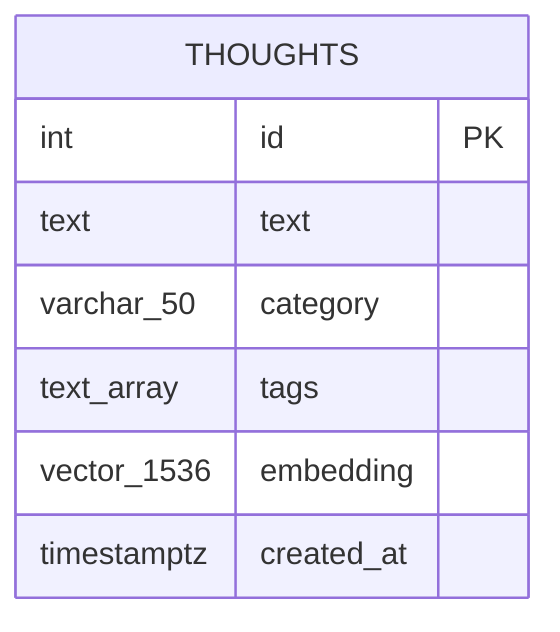

# feat: Build OpenBrain Local MCP Memory Server

## Overview

A local MCP server (TypeScript) backed by Postgres + pgvector. One open brain — any MCP-compatible client (Claude Desktop, Cursor, etc.) can read from and write to the same memory store. You drop a thought; it gets auto-categorized and embedded. Any agent retrieves it later via semantic search.

## Problem Statement

Each AI tool maintains its own isolated memory. There is no way to share knowledge across tools or persist insights over time. OpenBrain provides a single, local, vector-backed memory layer that any MCP client can use.

## Proposed Solution

A TypeScript MCP server using stdio transport, powered by:

| Layer | Technology |
|---|---|
| MCP protocol | `@modelcontextprotocol/sdk` — `McpServer` + `StdioServerTransport` |
| Storage | Postgres 17 + pgvector (HNSW index, cosine similarity) |
| Embeddings | OpenAI `text-embedding-3-small` (1536 dims) |
| Categorization | OpenAI `gpt-4o-mini` (cheap, fast classification) |
| DB client | `pg` (node-postgres) — raw SQL, works cleanly with pgvector casts |
| Validation | `zod` — MCP tool input schemas |

---

## Data Model

### Postgres Schema (`src/db/migrate.ts` — auto-runs on startup)

```sql
CREATE EXTENSION IF NOT EXISTS vector;

CREATE TABLE IF NOT EXISTS thoughts (
  id          SERIAL PRIMARY KEY,
  text        TEXT NOT NULL CHECK (char_length(text) BETWEEN 1 AND 8000),
  category    VARCHAR(50) NOT NULL DEFAULT 'Misc',
  tags        TEXT[] NOT NULL DEFAULT '{}',
  embedding   VECTOR(1536),
  created_at  TIMESTAMPTZ NOT NULL DEFAULT NOW()
);

CREATE INDEX IF NOT EXISTS thoughts_embedding_idx
  ON thoughts USING hnsw (embedding vector_cosine_ops);

CREATE INDEX IF NOT EXISTS thoughts_category_idx
  ON thoughts (category);

CREATE INDEX IF NOT EXISTS thoughts_created_at_idx
  ON thoughts (created_at DESC);
```

**Pre-seeded categories** (enforced by the categorization prompt, not a DB constraint):
`Projects`, `Real Estate`, `Farm`, `Learning`, `Recipes`, `People`, `Checklists`, `Decisions`, `Reflections`, `Meetings`, `Misc`

### ERD



---

## 6 Core Tool Contracts

### `add_thought`

| Parameter | Type | Required | Notes |
|---|---|---|---|
| `text` | `string` | Yes | 1–8000 chars (safe under 8192-token embedding limit) |
| `category` | `string` | No | Override auto-categorization with one of the 11 categories |

**Returns:** `{ id, category, tags, message }`

**Flow:**
1. Validate text length (1–8000 chars); reject immediately if invalid
2. If `category` not provided → call `gpt-4o-mini` to classify + extract tags
3. Call `text-embedding-3-small` to embed the text
4. `INSERT INTO thoughts (text, category, tags, embedding)`
5. Return `{ id, category, tags, message: "Thought saved." }`

**Failure strategy:**
- Categorization fails → save with category `Misc`, tags `[]`; note this in the response
- Embedding fails → **hard fail**, nothing saved; embedding is required for search
- Partial state (categorized but not embedded) → never written to DB; clean failure

---

### `search`

| Parameter | Type | Required | Default | Notes |
|---|---|---|---|---|
| `query` | `string` | Yes | — | Natural language search text |
| `limit` | `number` | No | `5` | 1–50 |
| `category` | `string` | No | — | Filter results within a specific category |
| `min_similarity` | `number` | No | `0.3` | Exclude results below this cosine similarity score |

**Returns:** `{ results: [{ id, text, category, tags, similarity, created_at }], count }`

**Flow:**
1. Embed the query with `text-embedding-3-small`
2. `SELECT ... ORDER BY embedding <=> $query_vec LIMIT $limit [WHERE category = $category]`
3. Filter out results where `1 - distance < min_similarity`
4. Return ranked results with similarity scores

---

### `list_recent`

| Parameter | Type | Required | Default | Notes |
|---|---|---|---|---|
| `limit` | `number` | No | `10` | 1–100 |
| `category` | `string` | No | — | Optional filter |

**Returns:** `{ thoughts: [{ id, text, category, tags, created_at }], count }`

---

### `list_by_category`

| Parameter | Type | Required | Default | Notes |
|---|---|---|---|---|
| `category` | `string` | Yes | — | One of the 11 pre-seeded categories |
| `limit` | `number` | No | `20` | 1–100 |
| `offset` | `number` | No | `0` | Pagination offset |

**Returns:** `{ thoughts: [{ id, text, category, tags, created_at }], count, total }`

---

### `get_stats`

No parameters.

**Returns:**
```json
{
  "total": 42,
  "by_category": { "Farm": 12, "Learning": 8, "Misc": 5 },
  "last_7_days": 14,
  "last_30_days": 38,
  "top_tags": [{ "tag": "chickens", "count": 5 }],
  "most_active_day": "2026-03-01"
}
```

---

### `delete_thought`

| Parameter | Type | Required | Notes |
|---|---|---|---|
| `id` | `number` | Yes | Integer ID from a previous add/search/list result |

**Returns:** `{ message: "Thought deleted." }` or error if ID not found.

**Behavior:** Hard delete. Returns an error (not silent success) when ID does not exist — agents need to know if their delete actually did something.

---

## Categorization Prompt (`src/lib/categorize.ts`)

```
You are a categorization assistant. Given a thought or note, return a JSON object with:
1. "category": exactly one of: Projects, Real Estate, Farm, Learning, Recipes, People,
   Checklists, Decisions, Reflections, Meetings, Misc
2. "tags": array of 0–5 lowercase keyword tags extracted from the content

If the content does not clearly fit any category, use "Misc".
Return only valid JSON, no other text.

Thought: {text}
```

---

## Project Structure

```
openBrain/
├── docker-compose.yml          # Postgres 17 + pgvector container
├── .env                        # DATABASE_URL, OPENAI_API_KEY (gitignored)
├── .env.example                # Template
├── package.json
├── tsconfig.json
├── src/
│   ├── index.ts                # MCP server entry point + startup validation
│   ├── db/
│   │   ├── client.ts           # pg Pool, connection config
│   │   └── migrate.ts          # Auto-migration on startup
│   ├── lib/
│   │   ├── embeddings.ts       # text-embedding-3-small wrapper
│   │   └── categorize.ts       # gpt-4o-mini categorization + tag extraction
│   └── tools/
│       ├── add-thought.ts
│       ├── search.ts
│       ├── list-recent.ts
│       ├── list-by-category.ts
│       ├── get-stats.ts
│       └── delete-thought.ts
```

---

## Technical Considerations

| Decision | Choice | Rationale |
|---|---|---|
| MCP transport | stdio | Local use; no network exposure needed |
| Log destination | `stderr` only | `stdout` is the MCP protocol wire — must never be polluted |
| Vector index | HNSW cosine | Best for small collections; no training data required (unlike IVFFlat) |
| Embedding dims | 1536 (full) | No dimension reduction in MVP; storage is trivial for personal use |
| Schema migration | Auto on startup | Simpler DX for a personal project |
| Categorization failure | Save with `Misc` | Thought is preserved and searchable; user notified in response |
| Embedding failure | Hard fail | No point storing a thought that can't be semantically retrieved |
| Max text length | 8000 chars | Safely under the 8192-token embedding API limit |
| Duplicate handling | Append-only | Intentional design; simplest mental model for a personal log |
| Edit/update tool | Not in scope | Delete + re-add is intentional; avoids embedding staleness |

**MCP-specific gotchas from research:**
- `console.error()` for all diagnostic output — stdout breaks the MCP wire protocol
- Pin `@modelcontextprotocol/sdk` to a specific version; the API has been evolving
- Vector values must be cast explicitly: `$1::vector` with string `[0.1,0.2,...]` format

---

## Acceptance Criteria

- [ ] `docker compose up -d` starts Postgres 17 with pgvector available
- [ ] Server starts via `node dist/index.js` and auto-migrates schema on first run
- [ ] Server exits with a clear, human-readable error if `DATABASE_URL` or `OPENAI_API_KEY` are missing
- [ ] `add_thought("I need to fix the barn fence")` stores thought, returns `category: "Farm"`
- [ ] `add_thought` with `category: "Projects"` overrides auto-categorization
- [ ] `search("barn repairs")` returns the above thought with `similarity > 0.3`
- [ ] `search` with `min_similarity: 0.7` filters out weakly related results
- [ ] `list_recent()` returns 10 most recent thoughts
- [ ] `list_by_category("Farm")` returns paginated Farm thoughts with `total` count
- [ ] `get_stats()` returns counts by category, last-7-day activity, top tags
- [ ] `delete_thought(id)` removes entry; subsequent search no longer returns it
- [ ] `delete_thought` with non-existent ID returns an error (not silent success)
- [ ] All 6 tools callable from Claude Desktop MCP client without errors
- [ ] Text over 8000 chars returns validation error before any API calls

---

## Success Metrics

- All 6 tools work from Claude Desktop end-to-end
- Auto-categorization correct on informal spot-check of 20 varied thoughts
- Semantic search returns relevant results for natural language queries
- Setup from zero to first working thought in < 15 minutes

---

## Dependencies & Risks

| Dependency | Risk | Mitigation |
|---|---|---|
| OpenAI API | Outage breaks `add_thought` and `search` | Clear error messages; local embedding fallback in Phase 2 |
| Postgres + pgvector local Docker | Docker required on host | Provide clear setup steps in README |
| `@modelcontextprotocol/sdk` | Evolving API | Pin to specific version in `package.json` |
| MCP client compatibility | Clients differ in behavior | Test with Claude Desktop first; stdio is the safest transport |

---

## Execution Order

### Phase 1 — MVP (~1.5 hours)
1. `docker-compose.yml` + `.env.example` + `package.json` + `tsconfig.json`
2. `src/db/client.ts` + `src/db/migrate.ts` (schema + HNSW index)
3. `src/lib/embeddings.ts` — embed function
4. `src/lib/categorize.ts` — GPT-4o-mini categorization + tag extraction
5. `src/tools/add-thought.ts`
6. `src/tools/search.ts`
7. `src/index.ts` — MCP server wiring, startup validation
8. Test with Claude Desktop

### Phase 2 — Enhancements
- Remaining tools: `list_recent`, `list_by_category`, `delete_thought`, `get_stats`
- Hybrid search: pgvector + `tsvector` full-text for exact keyword matches
- Local embedding fallback with `@xenova/transformers` (offline use)
- MCP Resources for subscribing to new thoughts

### Phase 3 — Polish
- Weekly review prompts and thought templates
- Bulk import from Apple Notes / Markdown files
- Minimal web UI for browsing

---

## References

### Code Patterns (from research)
- MCP tool registration: `server.registerTool(name, { inputSchema: z.object({...}) }, handler)`
- All logs: `console.error(...)` — never `console.log`
- pgvector cosine search: `ORDER BY embedding <=> $1::vector LIMIT $2`
- Similarity score: `1 - (embedding <=> $1::vector) AS similarity`
- Vector insert: pass as string `[${embedding.join(',')}]` with `$1::vector` cast
- Docker image: `pgvector/pgvector:pg17`
- HNSW index: `CREATE INDEX USING hnsw (embedding vector_cosine_ops)`

### Key SpecFlow Findings Incorporated
- Tags column added to schema (required for `get_stats` top tags)
- `category` override parameter on `add_thought`
- Pagination (`limit`/`offset`) on `list_by_category`
- `min_similarity` parameter on `search` with default 0.3
- Explicit tool output schemas defined
- Startup validation for required env vars
- Hard fail on embedding; graceful fallback on categorization
- Max text length enforced before API calls
